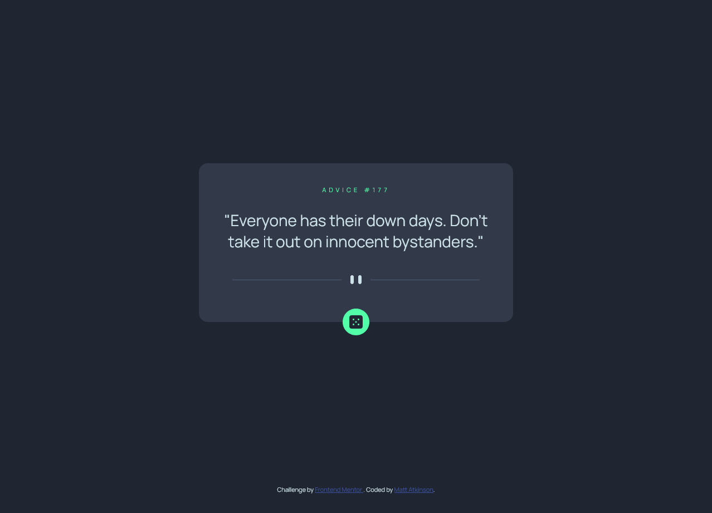

# Frontend Mentor - Advice generator app solution

This is a solution to the [Advice generator app challenge on Frontend Mentor](https://www.frontendmentor.io/challenges/advice-generator-app-QdUG-13db). Frontend Mentor challenges help you improve your coding skills by building realistic projects.

## Table of contents

- [Overview](#overview)
  - [The challenge](#the-challenge)
  - [Screenshot](#screenshot)
  - [Links](#links)
- [My process](#my-process)
  - [Built with](#built-with)
  - [What I learned](#what-i-learned)
  - [Continued development](#continued-development)
- [Author](#author)

## Overview

I chose this challenge as a way to demonstrate the use of API, within Javascript. The solution displays the
advice centered on screen, with a small "dice" button that on click will call a function to generate and display a
new piece advice. 

### The challenge

Users should be able to:

- View the optimal layout for the app depending on their device's screen size
- See hover states for all interactive elements on the page
- Generate a new piece of advice by clicking the dice icon

### Screenshot



### Links

- Solution URL: [My Solution on Github](https://github.com/matkinson01/advice-generator-app-main)
- Live Site URL: [https://matkinsonadvicegenerator.netlify.app/](https://matkinsonadvicegenerator.netlify.app/)

## My process

### Built with

- Semantic HTML5 markup
- CSS custom properties
- Flexbox
- CSS Grid
- Mobile-first workflow

### What I learned

This was a small challenge, but I did learn some things.

- CSS calc() - Specifically how I can center the button, using calc()
- CSS translateY - This is a css property I was familiar with, but have not really used before.
```css
#diceBtn {
    background: var(--accent-color);
    border-radius: 100%;
    width: 3rem;
    height: 3rem;
    display: flex;
    justify-content: center;
    align-items: center;
    position: absolute;
    left: calc(50% - (3rem / 2)); 
    transform: translateY(.5rem);
}
```

- JS - Reading the window size in order change the SVG of the divider. I am not sure this is a best practice,
       but It was cool to see that I could check the screen size. This means I did not need to do this with the CSS
       media query.
```js
window.addEventListener('resize', (e) => {
    patternDivider.innerHTML = window.innerWidth < 525 ? mobilePatternDivider : desktopPatternDivider;
})
```

- JS - window.onload - I discovered this when I needed the displayAdvice() function to run on load. This allows the 
       the responsive divider to work on the file load.
```js
window.onload = getAdvice();
```

### Continued development

Future improvements would be the addition of an advice filter, and maybe a light theme.

## Author

- Frontend Mentor - [@matkinson01](https://www.frontendmentor.io/profile/matkinson01)